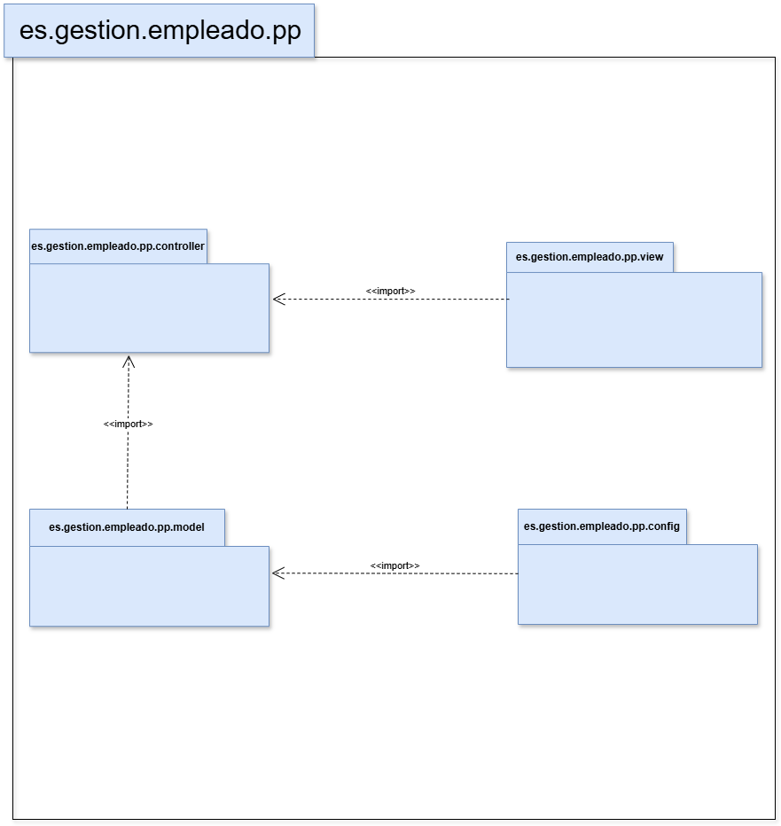

# gestion-empleado

## Definición breve sobre proyecto:
Este proyecto implementa un sistema de gestión de empleados que permite crear y gestionar diferentes tipos de empleados como Desarrolladores, Diseñadores, y Gerentes. Cada tipo de empleado tiene un bono diferente sobre su salario base y un método específico para calcular su salario final.

## Estructura
### clases:

1. <b>Empleado</b> (Clase abstracta)

<b> Atributos: </b>

 

id (String)

 

nombre (String)

 

fechaNacimiento (LocalDate)

 

salarioBase (double)

 

<b>Métodos:</b>

 

calcularSalarioFinal() (Método abstracto para calcular el salario final de cada tipo de empleado)

 

toString() (Devuelve un String con la información del empleado, incluyendo la edad calculada)

 

equals() y hashCode() (Para comparar empleados por su ID)

 

2. <b> Subclases de Empleado </b>

 

a. Desarrollador

Bono: 20% sobre el salario base. Método sobrescrito: calcularSalarioFinal()

 

b. Diseñador

Bono: 10% sobre el salario base. Método sobrescrito: calcularSalarioFinal()

 

c. Gerente

Bono: 30% sobre el salario base. Método sobrescrito: calcularSalarioFinal()

 

3. <b> Clase Programa </b>

<b> Objetivo </b>: Crear instancias de cada tipo de empleado (Desarrollador, Diseñador y Gerente), y mostrar su información incluyendo el salario final calculado.

## Diagrama-Packages

